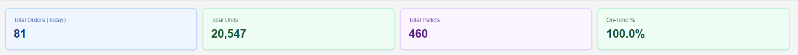
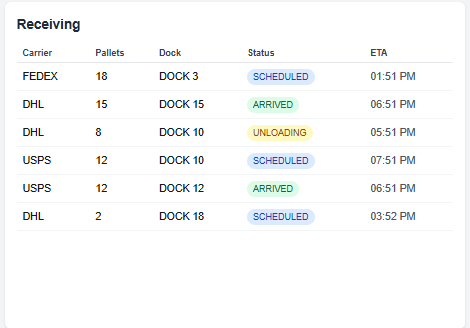
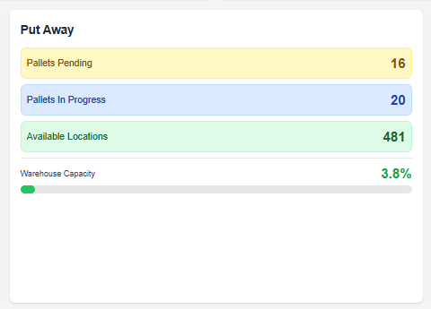
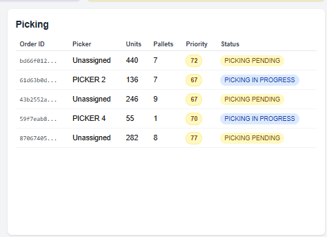
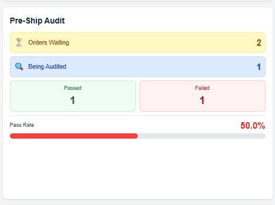
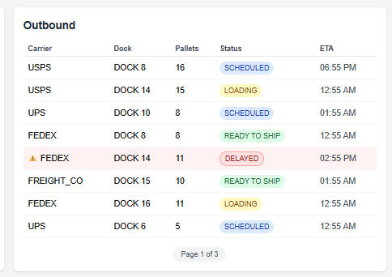
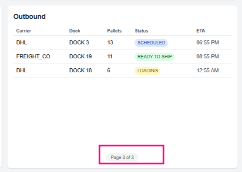

# Warehouse Operations Dashboard

A real-time warehouse operations dashboard that displays current warehouse activity and helps floor staff understand what's happening now, what's at risk, and what to work on next.

## Overview

This dashboard is designed to be displayed on large screens throughout a warehouse and auto-updates as activity changes via WebSocket connections.

## Tech Stack

### Backend (NestJS)
- **NestJS** - Node.js framework
- **TypeScript** - Type safety
- **Socket.io** - Real-time WebSocket communication
- **In-memory storage** - Fast data access (database can be added later)

### Frontend (Next.js)
- **Next.js 15** - React framework with App Router
- **TypeScript** - Type safety
- **Tailwind CSS** - Styling
- **Socket.io Client** - Real-time updates
- **React Query** - Server state management
- **Axios** - HTTP client with interceptors

## Features

### Dashboard View (Main Screen)
1. **Summary Metrics** (Top Bar)
   - Total orders (today)
   - Total units
   - Total pallets
   - On-time percentage

2. **Operational Widgets**
   - **Receiving**: Inbound shipments at docks (carrier, pallets, dock, status)
   - **Put Away**: Pallet statistics and warehouse capacity tracking
   - **Picking**: Active orders with assigned pickers and priority scores
   - **Pre-Ship Audit**: Audit statistics with pass/fail rates
   - **Outbound**: Scheduled shipments with at-risk highlighting

3. **Paginated / Carousel Tables**
   - Dashboard tables use **auto-rotating carousel pagination** so large lists don’t require scrolling
   - Pages cycle automatically on a configurable interval (e.g. every 30 seconds)
   - Fixed rows per page (default 5) with a page indicator (e.g. “Page 1 of 3”)
   - Suited to wall-mounted or passive displays where users don’t interact with the screen
   - Resets to page 1 when data changes so new items are shown first

4. **Real-Time Updates**
   - Dashboard updates instantly when data changes
   - WebSocket connection with auto-reconnect
   - Visual connection status indicator

### Admin Interface
- Create, view and edit orders
- Create, view, and edit shipments (including **Actual arrival time** for on-time %)
- Form validation and error handling
- Changes immediately reflect on dashboard

## Project Structure

```
warehouse-ops/
├── backend/              # NestJS backend
│   ├── src/
│   │   ├── orders/      # Orders module
│   │   ├── shipments/   # Shipments module
│   │   ├── dashboard/   # Dashboard aggregations
│   │   └── data/        # In-memory store
│   └── package.json
├── frontend/            # Next.js frontend
│   ├── app/            # Pages (App Router)
│   ├── components/     # React components
│   ├── hooks/          # Custom hooks
│   ├── lib/            # Utilities (API, Socket, Types)
│   └── package.json
└── README.md
```

## Getting Started

### Prerequisites
- **Node.js 18+** and npm (Download from [nodejs.org](https://nodejs.org/))
- **Git** (Download from [git-scm.com](https://git-scm.com/))


### Installation & Setup

Follow these steps to get the project running on your local machine:

#### 1. Clone the Repository
```bash
git clone git@github.com:Onelky/warehouse-ops.git
cd warehouse-ops
```


### Quick Start

**Option A: Using VS Code (Recommended)**

If you're using VS Code, you can set up and run everything with built-in commands:

1. **One-Time Setup**:
   - Press `Ctrl+Shift+P` (Windows/Linux) or `Cmd+Shift+P` (macOS)
   - Type "Tasks: Run Task" and press Enter
   - Select **"Complete Project Setup"** from the list
   - This installs all dependencies AND creates the `.env.local` file

2. **Run the application**:
   - Press `F5` or go to **Run and Debug** (Ctrl+Shift+D / Cmd+Shift+D)
   - Select **"Full Stack (Frontend + Backend)"** from the dropdown
   - Click the green play button

Both servers will start in two separate terminals. To stop: press **Shift+F5** to end the debug session, then in the **Terminal** panel click the trash icon on each server terminal to stop backend and frontend (or close those terminal tabs).

**How to see all available VS Code tasks:**
- Press `Ctrl+Shift+P` → Type "Tasks: Run Task" → See full list
- Or click **Terminal** menu → **Run Task...**

**Option B: Using Terminal**

```bash
# Terminal 1 - Backend
cd backend
npm install
npm run start:dev

# Terminal 2 - Frontend (in a new terminal)
cd frontend
npm install
cp .env.example .env.local  # or 'copy' on Windows
npm run dev
```


#### 4. Access the Application

Open your web browser and navigate to:
- **Dashboard**: http://localhost:3000
- **Admin Panel**: http://localhost:3000/admin

### VS Code Integration

This project includes VS Code configurations for an enhanced development experience. The `.vscode` folder contains:
- **launch.json** - Debug and run configurations
- **tasks.json** - Automated tasks for common operations
- **settings.json** - Recommended workspace settings

#### Launch Configurations (Run and Debug)

Available configurations in the **Run and Debug** panel (F5):

- **Full Stack (Frontend + Backend)** - Starts both servers via task, then keeps the session alive (recommended)
- **Backend (Dev)** - Run backend only in development mode
- **Backend (Debug)** - Run backend with debugger attached
- **Frontend (Dev)** - Run frontend only in development mode

#### Tasks

Available tasks via **Terminal > Run Task** (or `Ctrl+Shift+P` → "Tasks: Run Task"):

**Setup Tasks:**
- **Complete Project Setup** - Full setup: installs all dependencies + creates .env.local (recommended for first-time setup)
- **Install All Dependencies** - Install npm packages for both frontend and backend (also available as build task: `Ctrl+Shift+B`)
- **Install Backend Dependencies** - Install backend packages only
- **Install Frontend Dependencies** - Install frontend packages only
- **Setup Frontend Environment** - Creates .env.local from .env.example

**Run Tasks:**
- **Run Full Stack** - Start both servers (alternative to launch config)
- **Run Backend** - Start backend only
- **Run Frontend** - Start frontend only


### Environment Variables

**Frontend** (`.env.local`):
```env
NEXT_PUBLIC_API_URL=http://localhost:3001
```

**Backend**: No environment variables required for local development

## Usage

1. **Dashboard View**: Navigate to `http://localhost:3000`
   - View real-time warehouse operations
   - Monitor all operational stages
   - See at-risk shipments highlighted

2. **Admin Panel**: Click "Admin Panel" or navigate to `http://localhost:3000/admin`
   - Create new orders and shipments
   - Edit existing records
   - Delete records
   - Changes appear on dashboard instantly

## Admin → Dashboard: What to Change Where

Use the Admin Panel to add or edit data; the dashboard updates in real time. This section maps **what you want to change on the dashboard** to **what to do in Admin**.

---

### Wanna change the **Summary Metrics** (top bar)?

**Do this:**
- **Total orders (today)** — In Admin → **Orders**: create a new order, or edit an existing one. Only orders created *today* are counted.
- **Total units** — In Admin → **Orders**: create or edit orders and set **Units**. The bar shows the sum of all orders’ units.
- **Total pallets** — In Admin → **Orders**: create or edit orders and set **Pallets**. The bar shows the sum of all orders’ pallets.
- **On-time %** — In Admin → **Shipments**: for shipments you want to count as “completed,” set **Status** to `CLOSED` and set **Actual arrival time**. If actual arrival ≤ ETA, they count as on-time. The percentage is (on-time closed shipments / all closed shipments).

| *Screenshot: Dashboard summary bar* |
|------------------------------------|
|  |

---

### Wanna change the **Receiving** widget?

**Do this:**  
In Admin → **Shipments**: create or edit a shipment and set:
- **Flow type** = `INBOUND`
- **Status** = `SCHEDULED`, `ARRIVED`, or `UNLOADING`

Only inbound shipments with one of those three statuses appear in Receiving.  
*Tip:* Set **ETA** in the past (or leave **Actual arrival time** empty) to see the row highlighted as delayed (at-risk).

| *Screenshot: Receiving widget* |
|-------------------------------|
|  |

---

### Wanna change the **Put Away** widget?

**Do this:**  
In Admin → **Shipments**: create or edit **inbound** shipments and set:
- **Status** = `PUT_AWAY_PENDING` → counts toward “Pallets pending”
- **Status** = `PUT_AWAY_IN_PROGRESS` → counts toward “Pallets in progress”
- **Status** = `STORED` (and Flow type = INBOUND) → their pallets count toward warehouse capacity

The “Available locations” and capacity % are derived from total stored pallets (max 500). Change **Pallets** on shipments to move the numbers.

| *Screenshot: Put Away widget* |
|------------------------------|
|  |

---

### Wanna change the **Picking** widget?

**Do this:**  
In Admin → **Orders**: create or edit an order and set:
- **Status** = `PICKING_PENDING` or `PICKING_IN_PROGRESS`

Only orders with those two statuses appear in the Picking table. You can set **Assigned user** and **Priority score** to see them on the dashboard.

| *Screenshot: Picking widget* |
|-----------------------------|
|  |

---

### Wanna change the **Pre-Ship Audit** widget?

**Do this:**  
In Admin → **Orders**: create or edit orders and set:
- **Status** = `AUDIT_PENDING` → “Orders waiting”
- **Status** = `AUDIT_IN_PROGRESS` → “Orders being audited”
- **Status** = `AUDIT_PASSED` → “Passed” count and improves pass rate
- **Status** = `AUDIT_FAILED` → “Failed” count and lowers pass rate

Pass rate = Passed / (Passed + Failed). Add or change orders with these statuses to see the stats and rate update.

| *Screenshot: Pre-Ship Audit widget* |
|------------------------------------|
|  |

---

### Wanna change the **Outbound** widget?

**Do this:**  
In Admin → **Shipments**: create or edit a shipment and set:
- **Flow type** = `OUTBOUND`
- **Status** = `SCHEDULED`, `READY_TO_SHIP`, or `LOADING`

Only outbound shipments with one of those three statuses appear in Outbound.  
*Tip:* Set **ETA** in the past (or leave **Actual arrival time** empty) to see the row highlighted as at-risk/delayed.

| *Screenshot: Outbound widget* |
|------------------------------|
|  |


## Data Models

### Order
```typescript
{
  id: string;
  status: OrderStatus;
  units: number;
  pallets: number;
  assignedUser?: AssignedUser;
  priorityScore?: number;
  healthScore?: number;
  createdAt: Date;
  updatedAt: Date;
}
```

### Shipment
```typescript
{
  id: string;
  carrier: Carrier;
  eta: Date;
  actualArrivalTime?: Date;
  pallets: number;
  dock: Dock;
  status: ShipmentStatus;
  flowType: FlowType; // INBOUND | OUTBOUND
  createdAt: Date;
  updatedAt: Date;
  isDelayed: boolean; // Calculated field
}
```

### Data fields explained

Key fields (including ones added for the dashboard) and how they’re used:

#### Shipment fields

| Field | Type | Description |
|-------|------|-------------|
| **flowType** | `INBOUND` \| `OUTBOUND` | **Determines which dashboard widget the shipment appears in.** `INBOUND` → Receiving and Put Away widgets. `OUTBOUND` → Outbound widget. Required when creating/editing a shipment. |
| **status** | ShipmentStatus | Current stage (e.g. `SCHEDULED`, `ARRIVED`, `UNLOADING`, `PUT_AWAY_PENDING`, `STORED`, `READY_TO_SHIP`, `LOADING`, `CLOSED`). Together with `flowType`, controls whether a shipment shows in Receiving, Put Away, or Outbound. |
| **eta** | Date | Estimated time of arrival (or departure for outbound). Used to compute **on-time %** and to highlight delayed shipments. |
| **actualArrivalTime** | Date (optional) | When the shipment actually arrived (or left). Editable in the Admin shipment form as **Actual arrival time**. Set when closing a shipment; if `actualArrivalTime ≤ eta`, it counts as on-time in the Summary bar. Only shipments with status `CLOSED` and a set actual arrival time are included in the on-time % calculation. |
| **isDelayed** | boolean | **Calculated by the backend** (not stored). `true` when the shipment is not yet closed and the current time is past `eta`. Used to show at-risk rows on the dashboard. |
| **carrier** | Carrier | e.g. `FEDEX`, `UPS`, `DHL`, `USPS`, `FREIGHT_CO`. |
| **dock** | Dock | Dock assignment (`DOCK_1` … `DOCK_20`). |
| **pallets** | number | Number of pallets; used in Put Away stats and warehouse capacity. |

#### Order fields

| Field | Type | Description |
|-------|------|-------------|
| **status** | OrderStatus | Current stage (e.g. `CREATED`, `PICKING_PENDING`, `PICKING_IN_PROGRESS`, `AUDIT_PENDING`, `AUDIT_PASSED`, `AUDIT_FAILED`, `SHIPPED`, `CLOSED`). Determines whether the order appears in the Picking or Pre-Ship Audit widget. |
| **assignedUser** | AssignedUser (optional) | Which picker is assigned (`PICKER_1` … `PICKER_5`). Shown in the Picking widget. |
| **priorityScore** | number (optional) | Priority for picking; can be used for ordering or highlighting in the Picking widget. |
| **healthScore** | number (optional) | **Reserved for future use.** Will drive health/risk indicators once the calculation formula is defined. |
| **units** | number | Unit count; summed in the Summary bar “Total units”. |
| **pallets** | number | Pallet count; summed in the Summary bar “Total pallets”. |

#### Enums reference

- **OrderStatus**: `CREATED`, `PICKING_PENDING`, `PICKING_IN_PROGRESS`, `PICKED`, `AUDIT_PENDING`, `AUDIT_IN_PROGRESS`, `AUDIT_FAILED`, `AUDIT_PASSED`, `SHIPPING_PENDING`, `SHIPPING`, `SHIPPED`, `CLOSED`
- **ShipmentStatus**: `SCHEDULED`, `ARRIVED`, `UNLOADING`, `PUT_AWAY_PENDING`, `PUT_AWAY_IN_PROGRESS`, `STORED`, `READY_TO_SHIP`, `LOADING`, `CLOSED`
- **FlowType**: `INBOUND`, `OUTBOUND`
- **Carrier**: `FEDEX`, `UPS`, `DHL`, `USPS`, `FREIGHT_CO`
- **Dock**: `DOCK_1` … `DOCK_20`
- **AssignedUser**: `PICKER_1` … `PICKER_5`

## API Endpoints

### Dashboard
- `GET /api/dashboard/summary` - Summary metrics
- `GET /api/dashboard/receiving` - Receiving shipments
- `GET /api/dashboard/put-away` - Put away statistics
- `GET /api/dashboard/picking` - Picking orders
- `GET /api/dashboard/audit` - Audit statistics
- `GET /api/dashboard/outbound` - Outbound shipments

### Orders
- `GET /api/orders` - List all orders
- `GET /api/orders/:id` - Get single order
- `POST /api/orders` - Create order
- `PATCH /api/orders/:id` - Update order
- `DELETE /api/orders/:id` - Delete order

### Shipments
- `GET /api/shipments` - List all shipments
- `GET /api/shipments/:id` - Get single shipment
- `POST /api/shipments` - Create shipment
- `PATCH /api/shipments/:id` - Update shipment
- `DELETE /api/shipments/:id` - Delete shipment

### Enums
- `GET /api/enums/order-statuses` - Order status values
- `GET /api/enums/shipment-statuses` - Shipment status values
- `GET /api/enums/carriers` - Carrier values
- `GET /api/enums/docks` - Dock values
- `GET /api/enums/flow-types` - Flow type values

## WebSocket Events

### Server → Client
- `order:created` - New order created
- `order:updated` - Order updated
- `shipment:created` - New shipment created
- `shipment:updated` - Shipment updated
- `shipment:deleted` - Shipment deleted
- `dashboard:refresh` - Trigger full refresh

## Architecture Decisions

### Why In-Memory Storage First?
- Faster development and iteration
- Focus on WebSocket functionality (core requirement)
- Easy to add database persistence later (Prisma + SQLite/PostgreSQL)
- Sufficient for trial/demo purposes
- No database setup complexity during initial development

### Why Socket.io?
- Built-in reconnection logic
- Room support for future scaling
- Excellent NestJS integration
- Fallback to polling if WebSocket unavailable
- Handles network interruptions gracefully

### Why React Query?
- Automatic caching and refetching
- Optimistic updates
- Built-in loading and error states
- Works seamlessly with WebSocket invalidation
- Reduces boilerplate for data fetching

### Why Axios Interceptors?
- Centralized error handling
- Easy to add authentication later
- Request/response logging
- Consistent API calls across the application

### Why Carousel Pagination for Dashboard Tables?
**Problem**: Large datasets on dashboard tables would require scrolling, which is problematic for:
- Wall-mounted displays where users can't interact with the screen
- Quick glanceability - users need to see information at a glance without interaction
- Fixed viewport constraints on large screens

**Solution**: Auto-rotating carousel pagination
- Tables automatically cycle through pages every 5 seconds
- Shows 5 rows per page by default (configurable via `rowsPerPage` prop)
- Page indicator at bottom shows "Page 1 of 3" for context
- No manual interaction required - perfect for passive monitoring
- Implemented via `CarouselTable` component with `useTableCarousel` hook
- Resets to page 1 when data changes to ensure new items are visible

|  |


### Why Custom Hooks for Data Fetching?
- Encapsulates WebSocket subscription logic
- Centralizes React Query configuration
- Automatic cache invalidation on real-time updates
- Reusable across components (`useOrders`, `useShipments`, `useDashboard`)
- Separates data fetching concerns from UI rendering 

## Future Improvements

### High Priority
- [ ] **Database Persistence** - Replace in-memory storage with Prisma + PostgreSQL
  - Add data persistence across server restarts
  - Enable historical data tracking
  - Support concurrent users reliably
  
- [ ] **User Authentication & Authorization** - Add secure login system
  - Role-based access control (Admin, Picker, Manager, Viewer)
  - JWT-based authentication
  - Protected routes and API endpoints
  - Audit logs for data changes

- [ ] **Health Score Calculation** - Implement order health scoring algorithm
  - Factor in: time until deadline, completion percentage, resource availability
  - Visual indicators for at-risk orders
  - Predictive alerts for potential delays

### Medium Priority
- [ ] **Individual Pallet Tracking** - Track pallets with warehouse locations
  - Assign location codes (aisle, rack, level)
  - Track pallet movement history
  - Visual warehouse map
  - Location-based picking optimization


- [ ] **Better UI/UX design** 
  - The design of the dashboard is pretty basic currently and doesn't have a clear visual identity.
  - Responsive layouts for smaller screens
  - Offline capability for basic operations


- [ ] **Advanced Filtering & Search** - Improve data discovery
  - Full-text search across orders and shipments
  - Multi-field filtering
  - Saved filter presets
  - Quick filters for common queries

- [ ] **Manual Pagination Controls** - Add user-controlled pagination for admin views
  - Previous/Next buttons for admin tables
  - Page size selector (10, 25, 50, 100 rows)
  - Jump to page input
  - Keep auto-carousel for dashboard, add manual controls for admin

- [ ] **Notifications System** - Real-time alerts for critical events
  - Browser notifications for delayed shipments
  - Configurable notification rules
  - Notification history

- [ ] **Dark Mode** - Add dark theme option
  - Better for low-light warehouse environments
  - Reduce eye strain for long monitoring sessions
  - Automatic theme switching based on time

## Development Notes

- Dashboard designed for large screen displays (1920x1080 or larger recommended)
- Auto-reconnects WebSocket on connection loss
- Fallback polling every 30 seconds if WebSocket unavailable
- Color-coded status indicators for quick visual scanning
- At-risk highlighting for delayed shipments (red background)
- No authentication system (add before production use)
- Tables auto-rotate through pages every 30 seconds for passive monitoring
